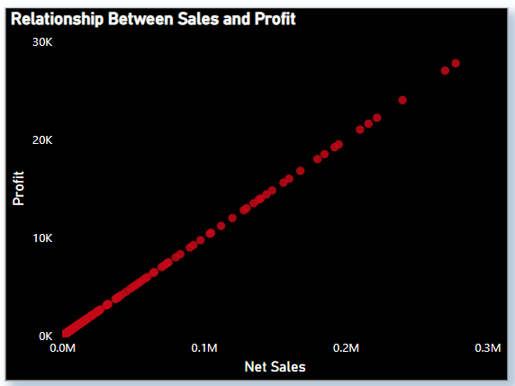

# 📈 Data Analytics Power BI Project - Sales Data Analysis

This project presents a complete **Sales Dashboard** built in **Power BI**, analyzing product performance, revenue trends, and region-wise sales. It leverages DAX for custom KPIs and provides a business-friendly interface for data-driven decisions.

---

## 💼 What I did in this project :

### 1. Data Modeling & Cleaning:
       - Imported raw sales data into Power BI
       - Cleaned and transformed it using Power Query Editor
       - Built a proper data model with relationships between tables (Sales, Products, Regions, Time)

### 2. Top/Bottom 5 Product Names by Net Sales, Quantity and Profit : Column Chart

### 3. Sales by time periods ( days, months, quarters and years ) : Area Chart

### 4. Average of Discount Values by Promotion Name : Column Chart

### 5. Relationship Between Sales and Profit : Scatter plot

### 6. Total Number of Orders : Card

### 7. Net Sales by Cities : Map

### 8. Compariosn of Total Sales, Profit and Quantity between two different time periods (using DAX) : Double Column Chart

### 9. Compariosn of Total Sales, Profit and Quantity between two different time periods (using inbuilt tools) : Double Column Chart

### 10. filters on whole dataset : Slicers and tables

## 🖼 Dashboard Preview

  
*A sample view of the interactive Power BI sales dashboard*

> 🔁 Make sure to add your dashboard screenshot in `images/` or update the link accordingly.

---

## 🛠 Tools & Features Used

- **Power BI Desktop**  
- Power Query for data cleaning  
- DAX for custom measures (Revenue, Profit, Growth, etc.)  
- Interactive visuals: bar charts, cards, maps, and slicers  
- Drill-through filters for deep dives

---

[Click to see Project's Video / Linkdin Post]()

---

